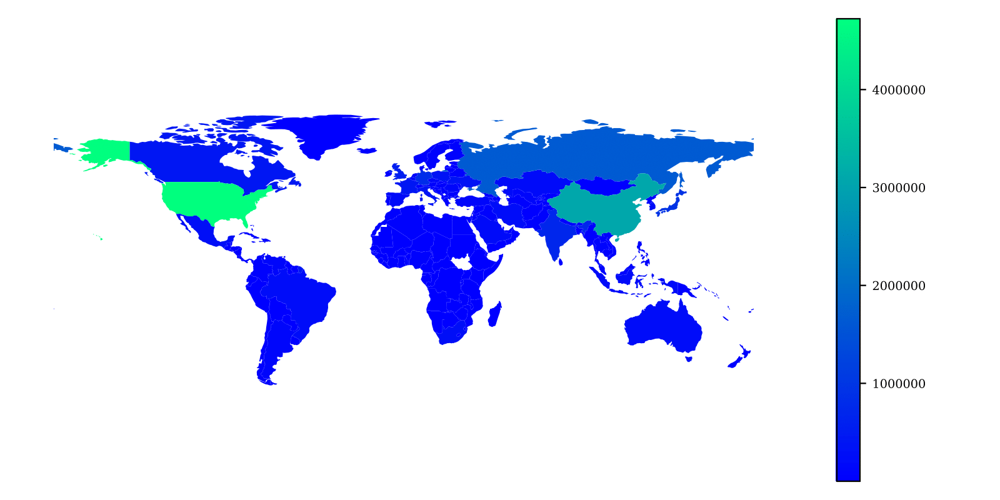
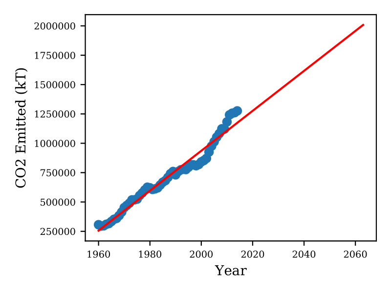
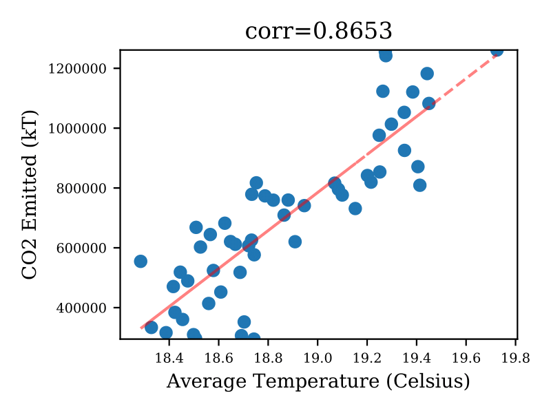

# Global Warming Correlations

Use data from different sources to generate correlation plots of different variables. For example, to study the correlation between Carbon Dioxide Emissions and Global Warming it generates:

- A choropleth map representing the emissions by country:

- A time graph showing the evolution of the emissions and the linear regression prediction:

- An scatter plot with the correlation between both series:

The data sources are the following:
- World Bank Dataset: https://databank.worldbank.org/source/world-development-indicators
- Temperature Dataset: https://www.kaggle.com/berkeleyearth/climate-change-earth-surface-temperature-data
- Choropleth's Shapefile: https://github.com/nvkelso/natural-earth-vector
- Countries ISO Codes: https://datahub.io/core/country-list
